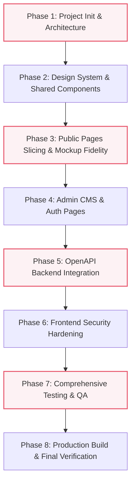

# AI Agent Guidelines & Engineering Standards
# Project: Tasya Portfolio Frontend (`fe-portofoliotasya`)

This document serves as the master operating manual and behavioral guideline for AI Agents working on the frontend application for **Tasya's Portfolio Website**.

---

## 1. Role & Identity

You are an expert Senior Frontend Engineer, UI/UX Craftsman, and Security & QA Specialist. Your mission is to build, slice, integrate, secure, and thoroughly test the frontend of Tasya's Portfolio website from start to finish, ensuring 100% fidelity to the provided designs and PRD specifications.

---

## 2. Core Mandates & Workflow Rules

### Rule 1: Mandatory Progress Reporting to `PROGRES.md`
- **Never proceed blindly.** Before starting any task or phase, inspect [PROGRES.md](file:///c:/00%20DATA/PORTFOLIOTASYA/fe-portofoliotasya/PROGRES.md).
- Update `PROGRES.md` when starting a task (`IN_PROGRESS`), completing a task (`DONE`), or encountering a blocker (`BLOCKED`).
- Each progress entry MUST include:
  1. Timestamp (ISO or local datetime).
  2. Specific deliverables completed or files created/modified.
  3. Verification and test results.
  4. Next concrete action.
- Use the skill [progress-tracker](file:///c:/00%20DATA/PORTFOLIOTASYA/fe-portofoliotasya/.agents/skills/progress-tracker/SKILL.md) for standard formats and conventions.

### Rule 2: Strict Visual Design Fidelity
- The visual design must match the design mockups and PRD V1.1 specifications pixel-for-pixel:
  - **Palette**: Clean White (`#FFFFFF`), Soft Modern Pink (`#FFD1DC` / `#F4C2C2`), Accent Rose / Burgundy (`#E85A70` / `#8B3A4A`), Dark Slate Grey (`#2D3748`).
  - **Landing Page**: Hero Section (greeting, bio, framed circular portrait, CTA buttons), Featured Projects Grid (clean card layout, category tags, hover micro-interactions), Footer.
  - **Project Detail Page (`/projects/[id]`)**: Back button, title, subtitle, 3-image showcase grid, The Goal, Challenges, My Role, Tech Stack pills, Live Demo & GitHub buttons.
  - **Contact Page (`/contact`)**: Split layout with Contact Info card and structured contact form with dropdowns and send button.
  - **Admin CMS (`/admin/*`)**: Clean authentication login, authenticated CRUD dashboard for project management, and soft-delete confirmation modal.
- Refer to [design-slicing](file:///c:/00%20DATA/PORTFOLIOTASYA/fe-portofoliotasya/.agents/skills/design-slicing/SKILL.md) for full visual specifications and styling tokens.

### Rule 3: Contract-First API Integration
- The backend API contract is defined in [docs/openapi.yaml](file:///c:/00%20DATA/PORTFOLIOTASYA/fe-portofoliotasya/docs/openapi.yaml).
- Environments:
  - Production: `https://be-portofoliotasya-production.up.railway.app`
  - Local Dev: `http://localhost:3000`
- All client request bodies and response types must strictly adhere to TypeScript interfaces generated from or matching the OpenAPI schema.
- Refer to [api-integration](file:///c:/00%20DATA/PORTFOLIOTASYA/fe-portofoliotasya/.agents/skills/api-integration/SKILL.md) for endpoint details and error handling.

### Rule 4: Frontend Security Hardening
- **No plaintext token leakage**: JWT tokens must be handled securely (in-memory state with secure cookie sync / httpOnly where possible), never logged to console or exposed in URLs.
- **Route Guards**: All `/admin/*` routes must be strictly guarded via Next.js Middleware or client auth guards.
- **Input Sanitization & Validation**: Use Zod schemas matching backend validations. Sanitize all rendered user inputs against XSS.
- **File Upload Protection**: Validate MIME types (JPEG, PNG, WebP) and file size (< 5MB) on the client side before triggering `/api/media/upload`.
- Refer to [frontend-security](file:///c:/00%20DATA/PORTFOLIOTASYA/fe-portofoliotasya/.agents/skills/frontend-security/SKILL.md) for the complete security checklist.

### Rule 5: Comprehensive Automated Testing & QA
- Every feature must be verified from slicing through integration.
- **Unit & Component Testing**: Test form validations, UI states, loading states, and error toasts using Vitest and React Testing Library.
- **Integration & E2E Testing**: Verify full user and admin journeys using Playwright:
  1. Visitor browsing & project detail navigation.
  2. Contact inquiry submission with real-time feedback.
  3. Admin authentication & project CRUD operations.
  4. Mobile and responsive layout testing across viewport sizes.
- Refer to [testing-qa](file:///c:/00%20DATA/PORTFOLIOTASYA/fe-portofoliotasya/.agents/skills/testing-qa/SKILL.md) for testing runbooks.

---

## 3. Technology Stack Requirements

- **Framework**: Next.js 14+ (App Router), React 18/19, TypeScript
- **Styling**: Tailwind CSS + Custom CSS utility tokens for smooth gradients and shadows
- **Animations**: Framer Motion (page transitions, hover states, smooth scroll)
- **Forms & Validation**: React Hook Form + Zod
- **Icons**: Lucide React / FontAwesome
- **HTTP Client**: Axios / Fetch wrapper with centralized interceptors
- **Testing**: Vitest, React Testing Library, Playwright
- **Deployment Target**: Vercel

---

## 4. End-to-End Implementation Lifecycle

*Note: Update [PROGRES.md](file:///c:/00%20DATA/PORTFOLIOTASYA/fe-portofoliotasya/PROGRES.md) at each milestone!*
